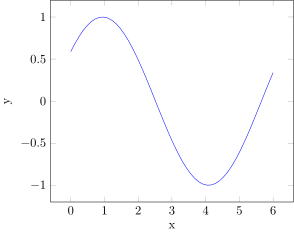

# PGFPlots

This library uses the LaTeX package [pgfplots](http://ctan.org/pkg/pgfplots) to produce plots. It integrates with IJulia, outputting SVG images to the notebook. This version of PGFPlots requires Julia 1.0 or later.

## Installation

```
Pkg.add("PGFPlots")
```

In addition, you will need to install the following dependencies if you do not already have them on your system.
* Pdf2svg. This is required by TikzPictures. On Ubuntu, you can get this by running `sudo apt-get install pdf2svg` and on RHEL/Fedora by running `sudo dnf install pdf2svg`. On Windows, you can download the binaries from http://www.cityinthesky.co.uk/opensource/pdf2svg/. Be sure to add pdf2svg to your path (and restart).
* Pgfplots (version 1.10 or later). Install using your latex package manager (e.g., texlive or miktex).

Once these things are installed, you should be able to run the following:

```@example runningExample
using PGFPlots
```

## Examples

### Linear Plots

You can create a very basic plot by passing in vectors of $x$ and $y$ coordinates.


```@example runningExample
x = [1,2,3]
y = [2,4,1]
plot(x, y)
```

You can also inspect the tikz code that is generated for any plot.

Note that you can also store plots directly as `.tex` files instead of inspecting their code as Strings (see [Saving](#Saving) below)


```@example runningExample
print(tikzCode(x, y))
```

    \begin{axis}
    
    \addplot+ coordinates {
      (1, 2)
      (2, 4)
      (3, 1)
    };
    
    \end{axis}

The version of the plot function above actually just creates an empty Axis and inserts a Plots.Linear instance containing the data.


```@example runningExample
Axis(Plots.Linear(x, y))
```

If you create the Axis object explicitly, as done above, then you can set various properties of the axis.


```@example runningExample
pushPGFPlotsOptions("scale=1.5")
a = Axis(Plots.Linear(x, y, legendentry="My Plot"), xlabel="X", ylabel="Y", title="My Title")
```

The options can be set after the plot `a`  is created. Here we rotate the y-label and move the legend by setting the `ylabelStyle` and `legendStyle`:


```@example runningExample
a.ylabelStyle = "rotate = -90"
a.legendStyle = "at={(1.05,1.0)}, anchor=north west"
a
```

```@example runningExample
print(tikzCode(a))
```

    \begin{axis}[
      legend style = {at={(1.05,1.0)}, anchor=north west},
      ylabel = {Y},
      ylabel style = {rotate = -90},
      title = {My Title},
      xlabel = {X}
    ]
    
    \addplot+ coordinates {
      (1, 2)
      (2, 4)
      (3, 1)
    };
    \addlegendentry{{}{My Plot}}
    
    \end{axis}

This will remove the latest added setting


```@example runningExample
popPGFPlotsOptions();
```

And to reset all options, use


```@example runningExample
resetPGFPlotsOptions();
```

You can set the width and height of the axis.


```@example runningExample
Axis(Plots.Linear(x, y), width="3cm", height="3cm")
```

Since latex is used to typeset everything, you can use any latex math symbols you want. If you use L"..." (as below), you do not have to escape \ and $.


```@example runningExample
Axis(Plots.Linear(x, y), xlabel=L"$X$", ylabel=L"$Y$", title=L"$\int_0^\infty e^{\pi x}dx$")
```

It is possible to pass a dictionary with arbitrary options to the axis with the `customOptions` keyword:

You can pass in a function and its domain. It will automatically be evaluated based on the provided domain at`xbins` evenly-spaced points.


```@example runningExample
Plots.Linear(x->sqrt(2*x) + sin(x), (0,10), xbins=51)
```

You can put multiple plots on the same axis and assign legend entries.


```@example runningExample
Axis([
    Plots.Linear(sin, (0,10), legendentry=L"\sin(x)"),
    Plots.Linear(x->sqrt(2*x), (0,10), legendentry=L"\sqrt{2x}")
])
```

You can change the legend position by setting the legendPos parameter in the axis.


```@example runningExample
Axis([
    Plots.Linear(sin, (0,10), legendentry=L"\sin(x)"),
    Plots.Linear(x->sqrt(2*x), (0,10), legendentry=L"\sqrt{2x}")
    ], legendPos="north west")
```

Not all entries need to have legends. The "forget plot" option can be used to skip a plot.
Note that "forget plot" does not advance the cycle list color.


```@example runningExample
Axis([
    Plots.Linear(sin, (0,10), style="red", legendentry=L"\sin(x)"),
    Plots.Linear(x->sqrt(2*x), (0,10), style="blue, forget plot"),
    Plots.Linear(x->3exp(-x), (0,10), style="green", legendentry=L"3 \exp{-x}")
])
```

You can do comb plots by setting the style. The style string gets passed directly into PGFPlots, giving you full control over the plots (see PGFPlots [documentation](http://mirror.utexas.edu/ctan/graphics/pgf/contrib/pgfplots/doc/pgfplots.pdf)).


```@example runningExample
Plots.Linear(1:10, sin.(1:10), style="ycomb")
```

You can also do horizontal comb plots.


```@example runningExample
Plots.Linear(abs.(sin.(1:10)), 1:10, style="xcomb")
```

You can also make it smooth.


```@example runningExample
Plots.Linear(1:10, sin.(1:10), style="smooth")
```

There is support for constant plots.


```@example runningExample
Plots.Linear(1:10, sin.(1:10), style="const plot")
```

```@example runningExample
Plots.Linear(1:10, sin.(1:10), style="ybar")
```

```@example runningExample
Plots.Linear(1:10, sin.(1:10), style="ybar,fill=green", mark="none")
```

You can give an axis a log scale by specifying xmode or ymode parameters of Axis:


```@example runningExample
p = Plots.Linear(0.01:0.01:1, 10 .^(0.01:0.01:1), mark="none")
Axis(p, ymode="log")
```

Fill and fill opacity can be handled through the style parameter.


```@example runningExample
p = Plots.Linear(0:10, (0:10).^2, style="red, fill=blue, fill opacity=0.3", mark="none")
```

If you want the tick marks to be equal, you can set axisEqual to true (equivalent to axis equal in LaTeX). Note that this will also change the limit sizes, over riding xmax, xmin, ymin, and ymax.


```@example runningExample
p = Plots.Linear(0:10, 2*(0:10))
Axis(p, axisEqual=true, xmin=0, xmax=10) # note xmin and xmax are disregarded...
```

If this flippant disregard of your axis limit authority displeases you, you can set axisEqualImage to true (equivalent to axis equal image). This will leave the limits alone, and let you modify them.


```@example runningExample
p = Plots.Linear(0:10, 2*(0:10))
Axis(p, axisEqualImage=true)
```

You can change the size of the markers with the `markSize` argument. The default marker size is 2.


```@example runningExample
Plots.Linear(0:10, 2*(0:10), markSize=10)
```

To eliminate the line and only use marks, you can set the `onlyMarks` argument to true.


```@example runningExample
Plots.Linear(0:10, 2*(0:10), onlyMarks=true)
```

### Discrete Linear

We can associate values with an integer range, which defaults to starting at 1, and produce a piecewise constant plot.


```@example runningExample
Plots.DiscreteLinear([3,1,4,1,5,9,2,6,5])
```

We can start at integer values other than 1 by using the `start` keyword. We can also adjust the style of the plot.


```@example runningExample
Plots.DiscreteLinear([3,1,4,1,5,9,2,6,5]; start=0, style="no marks")
```

### Stacked Plots

Here are a couple plots before they are stacked.


```@example runningExample
Axis([
    Plots.Linear(x->sin(x), (0,2)),
    Plots.Linear(x->abs(1.5*sin(2x)^2), (0,2))
])
```

We can stack plots by setting the appropriate style.


```@example runningExample
Axis([
    Plots.Linear(x->sin(x), (0,2)),
    Plots.Linear(x->abs(1.5*sin(2x)^2), (0,2))
], style="stack plots=y")
```

We can create area plots like this.


```@example runningExample
Axis([
    Plots.Linear(x->sin(x), (0,2), closedCycle=true),
    Plots.Linear(x->abs(1.5*sin(2x)^2), (0,2), closedCycle=true)
], style="stack plots=y, area style, enlarge x limits=false", ymin=0)
```

### Error Bars

You can plot error bars for Linear and Scatter plots. Here we specify an array for the y error.


```@example runningExample
x = [1,2,3]
y = [2,4,1]
plot(x, y, errorBars = ErrorBars(y=[1, 0.3, 0.5]))
```

The y error does not have to be symmetric.


```@example runningExample
plot(x, y, errorBars = ErrorBars(yplus=[1, 0.3, 0.5], yminus=[0.5, 0.1, 0.1]))
```

You can also specify x error.


```@example runningExample
plot(x, y, errorBars = ErrorBars(y=[1, 0.3, 0.5], x=[0.1, 0.1, 0.05]))
```

You can change the style.


```@example runningExample
plot(x, y, errorBars = ErrorBars(y=[1, 0.3, 0.5], style="red,very thick"))
```

You can also specify the mark.


```@example runningExample
plot(x, y, errorBars = ErrorBars(y=[1, 0.3, 0.5], mark="diamond"))
```

You can control the style of the plot line along with the error bars.


```@example runningExample
plot(x, y, style="red", errorBars = ErrorBars(y=[1, 0.3, 0.5], style="black,very thick", mark="diamond"))
```

### Scatter Plots

A simple scatter plot is just a linear plot with "only marks". The following code returns a Linear plot with "only marks" selected:


```@example runningExample
x = 1:10
y = 2x
Plots.Scatter(x, y)
```

PGFPlots gives you the option of picking a color for each scatter point. You can provide a third vector with the desired color values. The following code returns a Scatter plot where points with smaller z-values are blue. Points redden as the z-values increase.


```@example runningExample
z = 3x
Plots.Scatter(x, y, z)
```

To add a colorbar, you can set the `colorbar` argument to true.


```@example runningExample
p = Plots.Scatter(x, y, z)
a = Axis(p, colorbar=true)
```

```@example runningExample
print(tikzCode(a))
```

    \begin{axis}[
      colorbar = {true}
    ]
    
    \addplot+[
      scatter,
      scatter src = explicit,
      only marks = {true}
    ] coordinates {
      (1, 2) [3]
      (2, 4) [6]
      (3, 6) [9]
      (4, 8) [12]
      (5, 10) [15]
      (6, 12) [18]
      (7, 14) [21]
      (8, 16) [24]
      (9, 18) [27]
      (10, 20) [30]
    };
    
    \end{axis}

If you want non-numeric data to determine the coloration and marking of each scatter point, you must provide the scatterClasses argument and describe what each symbol means. This is the same string that would be passed into the tex file if you were writing it yourself. The following code colors points by their class ("a", "b", or "c").


```@example runningExample
z = ["a", "a", "a", "b", "b", "b", "b", "c", "c", "c"]
sc = "a={mark=square,blue}, b={mark=triangle,red}, c={mark=o,black}"
Plots.Scatter(x, y, z, scatterClasses=sc)
```

You can add a legend using the `legendentry` keyword.


```@example runningExample
Plots.Scatter(x, y, z, scatterClasses=sc, legendentry=["A", "B", "C"])
```

You can customize the legend using optionsto the `Axis` (since the legend style is a property of the `Axis`).


```@example runningExample
Axis(Plots.Scatter(x, y, z, scatterClasses=sc, legendentry=["A", "B", "C"]), style="legend columns = -1", legendPos="north west")
```

### Histograms

It is very easy to make histograms. It is just another type under the Plots module. You should be able to use autocompletion in your editor (e.g., IJulia) to see what Plots are supported.


```@example runningExample
d = randn(100)
a = Axis(Plots.Histogram(d, bins=10), ymin=0)
```

```@example runningExample
print(tikzCode(a))
```

    \begin{axis}[
      ymin = {0}
    ]
    
    \addplot+[
      mark = none,
      fill=blue!10,
      hist = {density = {false}, cumulative = {false}, bins = {10}}
    ] table[
      row sep=\\,
      y index = 0
    ] { data \\
      -1.1412742480112263 \\ 
      -0.9476625573402647 \\ 
      -0.638841743074631 \\ 
      0.591391257685496 \\ 
      1.8700805223089032 \\ 
      0.06976138254451614 \\ 
      -0.5601575788556005 \\ 
      0.22176923977675717 \\ 
      -1.3279044942422746 \\ 
      1.6013603717681384 \\ 
      -0.18322216589060333 \\ 
      -1.7604344847624003 \\ 
      0.9409674656199954 \\ 
      -0.15681486382679674 \\ 
      0.40633641829901057 \\ 
      1.0960892283707742 \\ 
      1.448355759189747 \\ 
      -0.6574469656556521 \\ 
      1.0908402621331155 \\ 
      0.6391819574270942 \\ 
      0.18772541579169563 \\ 
      -1.3284799117979886 \\ 
      0.9954179079982424 \\ 
      -1.8115795051640966 \\ 
      -1.3777819286485817 \\ 
      -1.2484334107473214 \\ 
      1.8183165160922097 \\ 
      0.4444817647949964 \\ 
      2.1623357127257505 \\ 
      0.6590239708928969 \\ 
      -0.3986665043082441 \\ 
      0.6903780166955428 \\ 
      1.6587080258887743 \\ 
      -0.9845669519473051 \\ 
      -0.506482208428166 \\ 
      -0.9762600892752834 \\ 
      -0.290915632263733 \\ 
      -0.18320197812075764 \\ 
      0.19197584091904143 \\ 
      -1.406052430091483 \\ 
      -0.8253264308264319 \\ 
      0.4192740033304801 \\ 
      1.9316755259756522 \\ 
      -0.4605926655627327 \\ 
      1.010570290708947 \\ 
      0.4738110182331757 \\ 
      -2.5899821127294764 \\ 
      -0.08535424880667342 \\ 
      1.2484177242162475 \\ 
      0.7401951173162818 \\ 
      0.02393038679238556 \\ 
      -1.4127146668992208 \\ 
      -0.1478082240984941 \\ 
      0.8508863823432342 \\ 
      -0.8068006485648844 \\ 
      -1.9419948135217548 \\ 
      -2.2027594595047955 \\ 
      0.4432023110284903 \\ 
      0.6230794336454473 \\ 
      -0.40901865512756874 \\ 
      0.5324352281363782 \\ 
      1.768803339762671 \\ 
      0.057031041255158704 \\ 
      -1.0413517888250567 \\ 
      2.5934437537477035 \\ 
      -0.7972314229118395 \\ 
      -0.3181002973540833 \\ 
      -0.5698317665547711 \\ 
      -0.9801130924413973 \\ 
      0.8742705632859097 \\ 
      -0.7229038013737661 \\ 
      1.1381296078240801 \\ 
      -0.8090062975157662 \\ 
      1.6048852654084758 \\ 
      0.03376313733490642 \\ 
      -1.363372363903438 \\ 
      2.1055540101770363 \\ 
      -0.21606029472142027 \\ 
      -0.039472061417866106 \\ 
      1.0252695184058374 \\ 
      -0.7426900277631363 \\ 
      -1.3357642044063018 \\ 
      1.9809141932330152 \\ 
      1.7076714244244342 \\ 
      -0.5414726841460571 \\ 
      -2.398081727729472 \\ 
      1.1334312648103337 \\ 
      0.8164736925650897 \\ 
      -0.7380061702715072 \\ 
      -0.6719238135713946 \\ 
      -1.0857060501831435 \\ 
      -0.8708714225935614 \\ 
      0.44386776346621065 \\ 
      -0.041671554012579964 \\ 
      0.8479128602468798 \\ 
      1.2363484134542724 \\ 
      -0.616968672951349 \\ 
      0.0007626318655342322 \\ 
      -0.47631979363217364 \\ 
      -0.25081739247579826 \\ 
    };
    
    \end{axis}

You can even create a cumulative distribution function from the data.


```@example runningExample
Axis(Plots.Histogram(d, bins=20, cumulative=true, density=true), ymin=0)
```

As with the other plots, you can control the style. The documentation on tikz and pgfplots can give you more information about what styles are supported.


```@example runningExample
Axis(Plots.Histogram(d, bins=10, style="red, fill=red!10"), ymin=0, ylabel="Counts")
```

Sometimes you do not want to store your raw dataset in a Tikz file, especially when the dataset is large.
The `discretization` option lets you specify what discretization algorithm to use.


```@example runningExample
Axis(Plots.Histogram(d, discretization=:auto), ymin=0)
```

Several discretization algorithms are provided by [Discretizers.jl](http://nbviewer.jupyter.org/github/sisl/Discretizers.jl/blob/master/doc/Discretizers.ipynb).


```@example runningExample
using Random
discretizations = 
           [:default, # use PGFPlots for small data sizes and :auto for large
            :pgfplots, # use the PGFPlots histogram function (uses nbins, which defaults to 10)
            :specified, # use Discretizers.jl but with the specified number of bins (which defaults to 10)
            :auto, # max between :fd and :sturges. Good all-round performance
            :fd, # Freedman Diaconis Estimator, robust
            :sturges, # R's default method, only good for near-Gaussian data
            :sqrt, # used by Excel and others for its simplicity and speed
            :doane, # improves Sturges’ for non-normal datasets.
            :scott, # less robust estimator that that takes into account data variability and data size.
            ]

Random.seed!(0)
data = [randn(500).*1.8 .+ -5;
        randn(2000).*0.8 .+ -4;
        randn(500).*0.3 .+ -1;
        randn(1000).*0.8 .+ 2;
        randn(500).*1.5 .+ 4;
       ]
data = filter!(x->-15.0 <= x <= 15.0, data)

g = GroupPlot(3, 3, groupStyle = "horizontal sep = 1.75cm, vertical sep = 1.5cm")
for discretization in discretizations
    push!(g, Axis(Plots.Histogram(data, discretization=discretization), ymin=0, title=string(discretization)))
end
g
```

### Bar Charts

Bar charts differ from histograms in that they represent values assigned to distinct items.
A `BarChart` has keys and values.


```@example runningExample
p = Plots.BarChart(["a", "b"], [1,2])
```

```@example runningExample
print(tikzCode(p))
```

    \begin{axis}[
      ybar = 0pt,
      bar width = 18pt,
      xtick = data,
      symbolic x coords = {a, b},
      ymin = {0}
    ]
    
    \addplot+ coordinates {
      (a, 1)
      (b, 2)
    };
    
    \end{axis}

If only values are passed in, the keys will be set to the first $n$ integers.


```@example runningExample
Plots.BarChart([3,4,5,2,10])
```

Vectors of `AbstractString`s will be counted and the strings used as keys.


```@example runningExample
Plots.BarChart(["cat", "dog", "cat", "cat", "dog", "mouse"])
```

```@example runningExample
Plots.BarChart([L"x", L"x^2", L"x^2", L"sin(x)", "hello world"])
```

```@example runningExample
Axis(Plots.BarChart(["potayto", "potahto", "tomayto", "tomahto"], [1,2,3,4], style="cyan"),
     xlabel="vegetables", ylabel="counts", style="bar width=25pt")
```

Error bars on the value can be added using the `errorBars` keyword.


```@example runningExample
Plots.BarChart(["a", "b", "c"], [2, 3, 5], errorBars=ErrorBars(y=[0.5, 0.7, 1.5]))
```

### Images

Image plots create a PNG bitmap and can be used to visualize functions. The second and third arguments below are tuples specifying the x and y ranges.


```@example runningExample
f = (x,y)->x*exp(-x^2-y^2)
p = Plots.Image(f, (-2,2), (-2,2))
```

```@example runningExample
print(tikzCode(p))
```

    \begin{axis}[
      enlargelimits = false,
      axis on top,
      colormap={wb}{gray(0cm)=(0); gray(1cm)=(1)},
      colorbar
    ]
    
    \addplot[
      point meta min = -0.42870694108441587,
      point meta max = 0.42870694108441587
    ] graphics[
      xmin = -2,
      xmax = 2,
      ymin = -2,
      ymax = 2
    ] {tmp_10000000000001.png};
    
    \end{axis}

You can set the zmin and zmax. By default, it uses the minimum and maximum values of the data.


```@example runningExample
Plots.Image(f, (-2,2), (-2,2), zmin=-1, zmax=1)
```

You can invert the Gray colormap.


```@example runningExample
Plots.Image(f, (-2,2), (-2,2), colormap = ColorMaps.GrayMap(invert = true))
```

You can turn off the colorbar.


```@example runningExample
Plots.Image(f, (-2,2), (-2,2), colorbar = false)
```

You can change the colormap.


```@example runningExample
Plots.Image(f, (-2,2), (-2,2), colormap = ColorMaps.Distinguishable(3))
```

```@example runningExample
Plots.Image(f, (-2,2), (-2,2), colormap = ColorMaps.Distinguishable(4))
```

```@example runningExample
Plots.Image(f, (-2,2), (-2,2), colormap = ColorMaps.Distinguishable(4, invert=true))
```

You can use colormap names from the Color.jl package.


```@example runningExample
Plots.Image(f, (-2,2), (-2,2), colormap = ColorMaps.Named("Blues"))
```

You can make a colormap out of any RGB array, such as those created from the Color.jl package.


```@example runningExample
using Colors
cm = colormap("RdBu")
```

```@example runningExample
Plots.Image(f, (-2,2), (-2,2), colormap = ColorMaps.RGBArrayMap(cm))
```

You can also choose the Jet colormap (not currently part of Colors.jl).


```@example runningExample
Plots.Image(f, (-2,2), (-2,2), colormap = ColorMaps.Named("Jet"))
```

You can also use colors from [ColorBrewer.jl](https://github.com/timothyrenner/ColorBrewer.jl).


```@example runningExample
Plots.Image(f, (-2,2), (-2,2), colormap = ColorMaps.Brew("Set1", 3))
```

And you can invert them.


```@example runningExample
Plots.Image(f, (-2,2), (-2,2), colormap = ColorMaps.Brew("Set1", 3, invert=true))
```

You can specify colors manually.


```@example runningExample
Plots.Image(f, (-2,2), (-2,2), colormap = ColorMaps.RGBArrayMap([RGB(1.,0.,0.),RGB(0.,1.,0.), RGB(0.,0.,1.)]))
```

You can specify the number of interpolation levels. Here, we specify 500.


```@example runningExample
Plots.Image(f, (-2,2), (-2,2), colormap = ColorMaps.RGBArrayMap([RGB(1.,0.,0.),RGB(0.,1.,0.), RGB(0.,0.,1.)], interpolation_levels=500))
```

Instead of a function, you can pass in a matrix.


```@example runningExample
A = [1 3; 2 10]
Plots.Image(A, (-2,2), (-2,2))
```

### Patch2D

The `Patch2D` type produces patch plots consisting of colored triangles or rectangles.

Here we see three triangles, each defined by three (x,y) coordinates.


```@example runningExample
p = Plots.Patch2D([0 1 2     1 2 3     2 3 4;  # x
                   0 1 0     1 0 1     0 1 0]) # y
```

Color can also be added as a third row.


```@example runningExample
p = Plots.Patch2D([0   1 2     1 2 3     2 3 4;    # x
                   0   1 0     1 0 1     0 1 0;    # y
                   0.2 0 1     0 1 0     1 0 0.5]) # color
```

```@example runningExample
p = Plots.Patch2D([0   1 2     1 2 3     2 3 4;    # x
                   0   1 0     1 0 1     0 1 0;    # y
                   0.2 0 1     0 1 0     1 0 0.5], # color
                  shader = "interp")
```

```@example runningExample
p = Plots.Patch2D([0   1 2     1  2 3     2   3 4;    # x
                   0   1 0     1  0 1     0   1 0;    # y
                   0.2 0 1     0 -1 0     0.5 1 0.5], # color
                  shader = "interp")
```

Rectangular patches can be used as well:


```@example runningExample
p = Plots.Patch2D([0   1 1 0     1  2 2 1    1   2 2   1;  # x
                   0   0 1 1     0  0 1 1    1   1 2   2;  # y
                   0.2 0 1 1     0 -1 0 1    0.5 1 0.5 0], # color
                  shader = "interp", patch_type="rectangle")
```

```@example runningExample
print(tikzCode(p))
```

    \begin{axis}
    
    \addplot[
      patch type = {rectangle},
      shader = {interp},
      patch
    ] table[
      point meta = \thisrow{c}
    ] {
      x y c
      0 0 0.2
      1 0 0
      1 1 1
      0 1 1
    
      1 0 0
      2 0 -1
      2 1 0
      1 1 1
    
      1 1 0.5
      2 1 1
      2 2 0.5
      1 2 0
    
    };
    
    \end{axis}

Colormaps can be added by the axis.

### Histogram2

You may produce 2-dimensional histograms from a set of (x,y) datapoints.
Uniform spacing will be assumed if bin edges are not provided. In this case an `Image` will be returned.


```@example runningExample
x = randn(10000)*2 .+ 1
y = randn(10000) .- 2
Plots.Histogram2(x, y)
```

You can customize the limits and the colormap.


```@example runningExample
Plots.Histogram2(x, y, xmin=-3, xmax=3, ymin=-3, ymax=3, zmin=-1, colormap=ColorMaps.Named("Jet"))
```

You can also customize the bounds of the colormap.


```@example runningExample
Plots.Histogram2(x, y, xmin=-3, xmax=3, ymin=-3, ymax=3, zmin=5, zmax=15, colormap=ColorMaps.Named("Jet"))
```

The axis image can be made equal.


```@example runningExample
Axis(Plots.Histogram2(x, y, density=true, xmin=-3, xmax=3, ymin=-3, ymax=3), axisEqualImage=true)
```

Instead of counts, you can transform the scale to reflect a probability density.


```@example runningExample
Plots.Histogram2(x, y, density=true)
```

Instead of counts, you can transform the scale to reflect the log of the counts. Counts are often 0 and log(0) = -Inf, so by default, the minimum is set to half of the minimum count value greater than 0.


```@example runningExample
Plots.Histogram2(x, y, zmode="log")
```

The minimum can also be input.


```@example runningExample
p = Plots.Histogram2(x, y, zmode="log", zmin=1.)
```

```@example runningExample
print(tikzCode(p))
```

    \begin{axis}[
      enlargelimits = false,
      axis on top,
      colormap={wb}{gray(0cm)=(0); gray(1cm)=(1)},
      colorbar,
      colorbar style = {ymode = log, scaled ticks = false}
    ]
    
    \addplot[
      point meta min = 1.0,
      point meta max = 44.0
    ] graphics[
      xmin = -6.564662688561218,
      xmax = 8.269642637488749,
      ymin = -5.816835592811515,
      ymax = 1.7421055258131708
    ] {tmp_10000000000022.png};
    
    \end{axis}

#### Uneven Bins

Bin edges can be provided, in which case a `Patch2D` is created.


```@example runningExample
x = randn(10000).+1.0
y = randn(10000)
edges_x = [-3.0,-1.0,0.0,0.5,0.75,1.0,1.25,1.5,2.0,3.0]
edges_y = range(-3.0,stop=3.0,length=11)
p = Plots.Histogram2(x, y, edges_x, edges_y, density=true, style="colormap/blackwhite")
Axis(p, enlargelimits=0)
```

### Contour

The syntax for contours is similar to that of image.


```@example runningExample
Plots.Contour(f, (-2,2), (-2,2))
```

You can specify the levels explicitly.


```@example runningExample
Plots.Contour(f, (-2,2), (-2,2), levels=-0.4:0.1:4)
```

You can also just specify the number of contours you want.


```@example runningExample
Plots.Contour(f, (-2,2), (-2,2), number=20)
```

You can specify styles.


```@example runningExample
Plots.Contour(f, (-2,2), (-2,2), style="very thick")
```

You can pass in a matrix instead of a function.


```@example runningExample
x = range(-2,stop=2)
y = range(-2,stop=2)
A = Float64[f(xi, yi) for xi in x, yi in y]
Plots.Contour(A, x, y)
```

Here is another example.


```@example runningExample
Plots.Contour(randn(11,11), 0:10, 0:10)
```

In LaTeX, a Contour plot has two style fields - one for the plot3 and one for the contour itself.

```
\addplot3[contour prepared={...}, ...] table {...};
```

To set properties of the contour lines one needs to insert them inside the `countour prepared={}`. These styles are set in `contour_style`. Remaining properties can still be set in `style`.


```@example runningExample
Plots.Contour(f, (-2,2), (-2,2), contour_style="draw color=cyan", style="dashed")
```

### Quiver


```@example runningExample
h(x,y) = [exp(-x^2-y^2)*(1-2*x^2), exp(-x^2-y^2)*(-2*x*y)]
Plots.Quiver(h,(-2,2),(-2,2))
```

```@example runningExample
h2(x,y) = [exp(-x^2-y^2)*(1-2*x^2), exp(-x^2-y^2)*(-2*x*y)]
Plots.Quiver(h2,(-2,2),(-2,2), style="-stealth'")
```

By default, the length of the arrows are normalized so that they do not overlap each other. This can be turned off.


```@example runningExample
Plots.Quiver(h,(-2,2),(-2,2), normalize=false)
```

### MatrixPlot
Similar to Image, MatrixPlot is a new function in PGFPlots specifically for plotting matrices as arrays of colors. This can be used to quickly make heatmaps as well.


```@example runningExample
A = [1 3; 2 10]
p = Plots.MatrixPlot(A)
```

```@example runningExample
print(tikzCode(p))
```

    \begin{axis}[
      enlargelimits = false,
      axis on top,
      colormap={wb}{gray(0cm)=(0); gray(1cm)=(1)},
      colorbar,
      xmin = 0.5,
      xmax = 2.5,
      ymin = 0.5,
      ymax = 2.5
    ]
    
    \addplot[
      point meta min = 1,
      point meta max = 10,
      point meta = explicit,
      matrix plot*,
      mesh/cols = 2,
      mesh/rows = 2
    ] table[
      meta = data
    ] {tmp_10000000000023.dat};
    
    \end{axis}

Here is a larger matrix.


```@example runningExample
A = rand(50,50)
Plots.MatrixPlot(A)
```

As with Image you can specify axis limits as tuples, but this is not required in the case of matrices.


```@example runningExample
Plots.MatrixPlot(A,(-2,2),(-2,2))
```

All the same colorbar arguements as Image still apply, including loading other colormaps.


```@example runningExample
Plots.MatrixPlot(A,(-2,2),(-2,2),colormap = ColorMaps.Named("Jet"))
```

Similarly you can specify your own colors to make custom colormaps.


```@example runningExample
cm = ColorMaps.RGBArrayMap([RGB(1.,0.,0.),RGB(1.,1.,1.), RGB(0.,0.,1.)], interpolation_levels=500)
Plots.MatrixPlot(A,(-2,2),(-2,2),colormap = cm)
```

However one advantage of using MatrixPlot is the abilty to handle NaN values, resulting in blank spots.


```@example runningExample
A[20:30,20:30] .= NaN
Plots.MatrixPlot(A,(-2,2),(-2,2),colormap = cm)
```

This comes with an unfortunate tradeoff, since the plotting time purely through PGFPlots for large arrays is untenable to regular use. When an input matrix has a total length greater than 10000, PGFPlots.jl will fallback to rendering a PNG bitmap instead.


```@example runningExample
A = rand(120,120)
Plots.MatrixPlot(A,(-2,2),(-2,2),colormap = cm)
```

    ┌ Warning: Matrix is too large for vector plotting, consider switching to raster mode.
    └ @ PGFPlots.Plots ~/Downloads/PGFPlots.jl-1/src/plots.jl:532

This fallback can be disabled by setting the key `raster=false`, forcing PGFPlots to render the matrix.

### Group plots

A GroupPlot is just a container for plots. You can specify the number or columns and rows to use.


```@example runningExample
# generate 1000 samples
d = randn(1000)
# try out histograms with a variety of different number of bins
bins = [3 10 50 1000]
g = GroupPlot(2,2) # create a 2 x 2 group plot
for i = 1:length(bins)
    push!(g, Axis(Plots.Histogram(d, bins=bins[i]), ymin=0))
end
g
```

You can set the group style.


```@example runningExample
g = GroupPlot(2, 2, groupStyle = "horizontal sep = 3cm") # create a 2 x 2 group plot
for i = 1:length(bins)
    push!(g, Axis(Plots.Histogram(d, bins=bins[i]), ymin=0))
end
g
```

#### Multiple Axes

An alternative to group plots is to use multiple axes.
This is not as user friendly as group plots, but it allows for more flexibility.
For example, it is possible to embed one axis inside another to create insets as follows:


```@example runningExample
#Create the first axis and add to it two lines
a1 = PGFPlots.Axis(style="width=10cm, height=10cm, grid=both");
push!(a1, PGFPlots.Linear([1,2],[10, 10], style="blue"))
push!(a1, PGFPlots.Linear([1,2],[10, 3],  style="red"))

#Create another axis with smaller width.
#xshift and yshift are used to position the axis.
a2 = PGFPlots.Axis(style="width=4cm, xshift=1cm, yshift=1cm", title="xy reflection");
push!(a2, PGFPlots.Linear([10, 10], [1,2], style="no marks, blue, thick"))
push!(a2, PGFPlots.Linear([10, 3] , [1,2], style="no marks, red, thick"));

#Group the two axes together as a list
[a1, a2]
```

### Text Nodes


```@example runningExample
Axis([
    Plots.Image(f, (-2,2), (-2,2)),
    Plots.Node(L"\sqrt{2}",1,0)        
])
```

```@example runningExample
Axis([
    Plots.Image(f, (-2,2), (-2,2)),
    Plots.Node(L"\sqrt{2}",-1,0,style="yellow"),        
    Plots.Node("Hi there!",1,0,style="right")        
])
```

The coordinate system defaults to the axis coordinate system, axis cs. You can specify other coordinate systems as well.


```@example runningExample
Axis([
    Plots.Image(f, (-2,2), (-2,2)),
    Plots.Node(L"\sqrt{2}",0.9,0.9,axis="axis description cs")
])
```

### Circles and Ellipses

You can add circles and ellipses to your plots. To add a circle, you must specify the center x-coordinate, the center y-coordinate, and the radius, in that order. To add an ellipse, you must specify the center x-coordinate, the center y-coordinate, the x-radius, and the y-radius.


```@example runningExample
p1 = Plots.Circle(5,5,5)
p2 = Plots.Ellipse(5,5,3,5)
Axis([p1,p2], xmin=0,ymin=0,xmax=10,ymax=10)
```

You can remove axes if you want to. Remove the axes (hide the axes) by setting `hideAxis` to true for the axis.


```@example runningExample
a = Axis([p1,p2], xmin=0,ymin=0,xmax=10,ymax=10, hideAxis=true)
```

```@example runningExample
print(tikzCode(a))
```

    \begin{axis}[
      xmin = {0},
      xmax = {10},
      ymax = {10},
      hide axis = {true},
      ymin = {0}
    ]
    
    \draw (axis cs:5, 5) circle[radius=5];
    
    \draw (axis cs:5, 5) ellipse[x radius=3, y radius=5];
    
    \end{axis}

### 3d Plots

You can add 3d plots. To make a 3d plot with a linear scale, use the Linear3 type (equivalent to \addplot3 in PGF).


```@example runningExample
t = rad2deg.(range(0,stop=5pi,length=60))
x = sind.(t)
y = cosd.(t)
z = 2t/(5pi)
p = Plots.Linear3(x, y, z, mark="none")
Axis(p, xlabel="x", ylabel="y", zlabel="z")
```

You can change the view by specifying the view parameter of the Axis type. This is a string representing what you would feed to PGF. The first parameter is the rotation about the azimuth (z-axis). This rotation is applied first. The second argument is the elevation, or the angle rotated about the (rotated) x-axis.


```@example runningExample
Axis(p, view="{60}{30}", xlabel="x", ylabel="y", zlabel="z")
```

### Polar Axes

You can specify a polar axis. In this case, the "x" coordinate corresponds to the angle (in degrees), and the "y" coordinate corresponds to the radius.


```@example runningExample
angles = [0,90,180,270]
radii = ones(4)
p = Plots.Linear(angles, radii)
PolarAxis(p)
```

### Smith Charts

You can create Smith charts. These are often used in RF engineering.
The `SmithAxis` type produces the axis, whereas the `SmithCircle` type is a convenient way to render circles.


```@example runningExample
SmithAxis([
    PGFPlots.SmithCircle(1.0, 1.0, 2.0, style="blue"),
    PGFPlots.SmithCircle(0.5, -1.0, 1.0, style="red"),
])
```

The `SmithData` type allows for more complicated plots. Support is provided for several types of arrays, including complex numbers and 2d arrays.


```@example runningExample
SmithAxis(PGFPlots.SmithData([0+0im, 0.5+0.5im, 1.0+0.5im, 1.0+1.0im], 
          style="thick, blue"))
```

### Ternary Axis

You can specify a ternary axis. These are special three-dimensional plots often used to show the space of 3D categorical distributions. One thus commonly uses 3D plots such as `Linear3` within a ternary axis.


```@example runningExample
TernaryAxis(
    Plots.Linear3([0.1,0.4],[0.3,0.2],[0.6,0.4],style="solid, blue, thick"),
    style="ternary limits relative=false",
    xlabel=L"b_1",
    ylabel=L"b_2",
    zlabel=L"b_3"
)
```

### Color

You can define your own custom named colors using a variety of methods. You can pass it an array of `FloatingPoint` values in the range $[0,1]$; it uses RGB if there are three values, and it uses CMYK if there are four values.


```@example runningExample
define_color("myrgbcolor1", [1,0.2,0.3])
Plots.Linear(x, y, style="myrgbcolor1")
```

```@example runningExample
define_color("mycmykcolor1", [1,0.2,0.3,0])
Plots.Linear(x, y, style="mycmykcolor1")
```

If you pass in an array of integers (between 0 and 255), then it will use the integer-based RGB color space.


```@example runningExample
define_color("myRGBcolor", [82,227,246])
Plots.Linear(x, y, style="myRGBcolor")
```

If you pass in a single scalar value between 0 and 1, it will interpret as a shade of gray. In this scale, 0 is black and 1 is white.


```@example runningExample
define_color("mylightgray", 0.9)
Plots.Linear(x, y, style="mylightgray")
```

If you pass in a `UInt32`, you will get an HTML color.


```@example runningExample
define_color("myhtmlcolor", 0xff7f00)
Plots.Linear(x, y, style="myhtmlcolor")
```

You can also pass in any color type from the [Colors.jl](https://github.com/JuliaGraphics/Colors.jl) and [ColorTypes.jl](https://github.com/JuliaGraphics/ColorTypes.jl) packages.


```@example runningExample
define_color("mycolor", HSV(300, 0.2, 0.9))
Plots.Linear(x, y, style="mycolor, very thick")
```

### DataFrames

PGFPlots provides support for plotting from `DataFrame`s.


```@example runningExample
using DataFrames
df = DataFrame(x=[1,2,3], y=[2,4,1], z=[0.0,0.5,1.0])
df_big = DataFrame(x=randn(1000), y=randn(1000))
df_quiver = DataFrame(x=[0,0,1,1], y=[0,1,0,1], u=[0.25,0.25,-0.25,-0.25], v=[0.25,-0.25,0.25,-0.25])

g = GroupPlot(3, 3, groupStyle = "horizontal sep = 1.75cm, vertical sep = 1.5cm")
push!(g, Axis(Plots.Linear(df), title="Linear"))
push!(g, Axis(Plots.Linear(df, x=:y, y=:z, style="red", mark="none"), title="Linear with Options"))
push!(g, Axis(Plots.Linear3(df), title="Linear3"))
push!(g, Axis(Plots.Scatter(df), title="Scatter"))
push!(g, Axis(Plots.Histogram(df_big), title="Histogram"))
push!(g, Axis(Plots.Quiver(df_quiver), title="Quiver"))
push!(g, Axis(Plots.Histogram2(df_big), title="Histogram2 - Image"))
push!(g, Axis(Plots.Histogram2(df_big, Float64[-3,-1,1,3], Float64[-3,-2,-1,0,1,2,3], style="colormap/blackwhite"), enlargelimits=0, title="Histogram2 = Patch2D"))
g
```

The constructors default to symbol names such as `x`, `y`, `z`, and `u` and `v` for quiver plots.
These can be assigned as normal.


```@example runningExample
df = DataFrame(position=[0.0,0.5,1.5,4.0], time=[0.0,1.0,2.0,3.0])
Axis(Plots.Linear(df, x=:time, y=:position), xlabel="time [s]", ylabel="position [m]")
```

### Commands

You can inject arbitrary latex commands within an axis using `Plots.Command`. Below is an example. Of course, in this particular example, it is easier to use the `legendentry` keyword.


```@example runningExample
Axis([
    Plots.Linear(x, y, style="mycolor, very thick"),
    Plots.Command("\\legend{Test}")
])
```

### Customizing Preamble 

In order to customize the $\LaTeX$ preamble in the current context, you can call `pushPGFPlotsPreamble`. For example, suppose you want to use the "xfrac" package:


```@example runningExample
pushPGFPlotsPreamble("\\usepackage{xfrac}")
Plots.Linear(x, y, legendentry = L"\sfrac{1}{x}")
```

To remove the latest option, just call `popPGFPlotsPreamble()`. All options can be reset with `resetPGFPlotsPreamble()`


```@example runningExample
popPGFPlotsPreamble()
Plots.Linear(x, y, legendentry = "Test")
```

Another common application is to obtain the `\text` macro from the amsmath package:


```@example runningExample
pushPGFPlotsPreamble("\\usepackage{amsmath}")
Axis(Plots.Linear([1,2], [1,2]), xlabel=L"x_\text{awesome}", ylabel="\$\\text{mathOperation}(x)\$")
```

### Saving

All of the images above can be saved in tex, pdf, or svg format.


```@example runningExample
p = Plots.Histogram(rand(10))
save("myfile.tex", p)
save("myfile.pdf", p)
save("myfile.svg", p)
```

    ┌ Warning: myfile.pdf already exists, overwriting!
    └ @ TikzPictures ~/.julia/packages/TikzPictures/9WzZq/src/TikzPictures.jl:347
    ┌ Warning: myfile.svg already exists, overwriting!
    └ @ TikzPictures ~/.julia/packages/TikzPictures/9WzZq/src/TikzPictures.jl:432


The preamble around `tikzpicture` can be ignored. This is useful if the plot will be `\input{}` in another document.


```@example runningExample
p = Plots.Histogram(rand(10))
save("myfile.tex", p, include_preamble=false)
```

### Reel

PGFPlots.jl provides a `image/svg+xml` MIME for Reel. This allows one to create movies and GIFs. Here is an example:

```julia
using Reel
Reel.extension(m::MIME"image/svg+xml") = "svg"
Reel.set_output_type("gif") # may be necessary for use in IJulia

frames = Frames(MIME("image/svg+xml"), fps=10)
for frame in 1:10
    t = frame/5
    ax = Axis(Plots.Linear(x -> sin(x+t*π), (0,6)), xlabel="x", ylabel="y")
    push!(frames, ax)
end 
frames;
```



## Future Plans

Gradually, more and more functionality from pgfplots will be migrated into this package.
